# UAS-Semester1

# Ketentuan Program

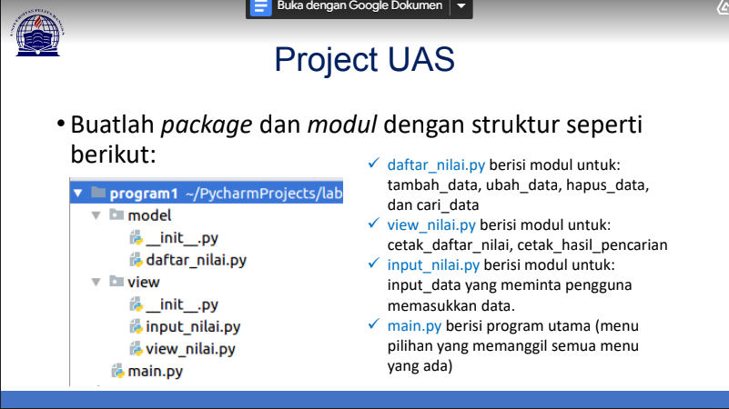
# Daftar Nilai

Langkah pertama adalah membuat file daftar_nilai.py. Sebelumnya kita harus membuat package yang berisi module seperti dalam ketentuan program di atas terlebih dahulu.

## Source Code

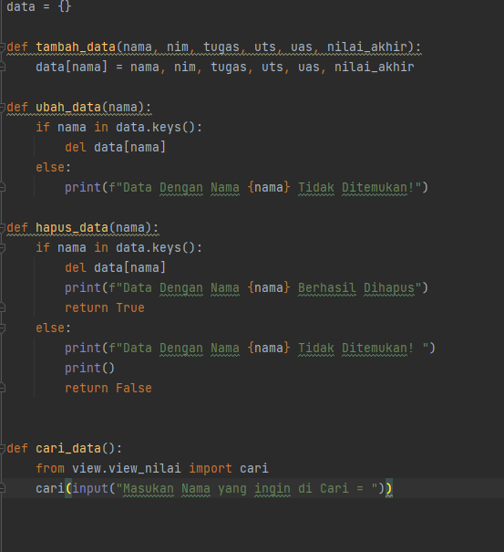
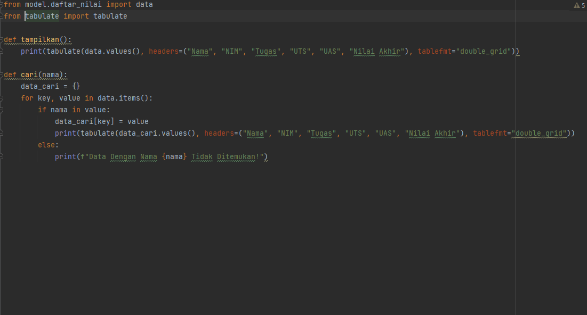
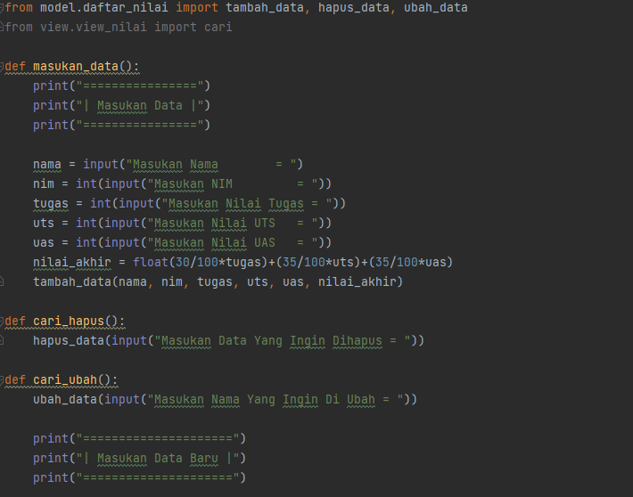
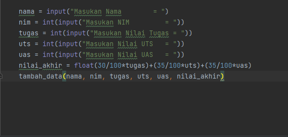
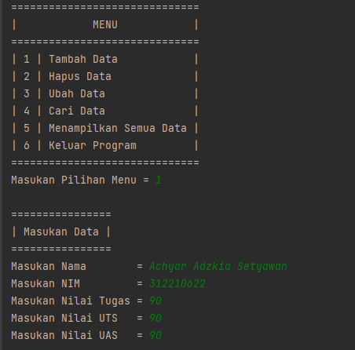
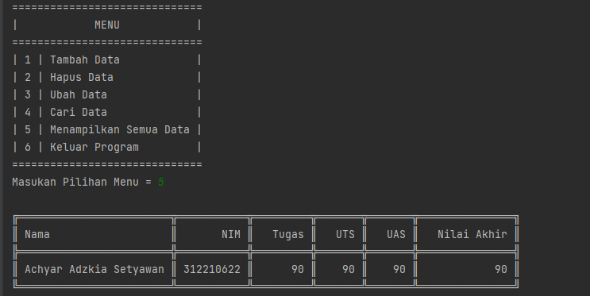
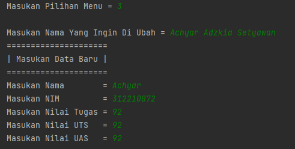
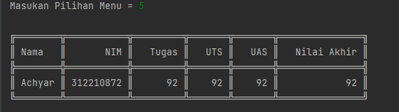
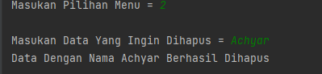
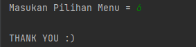
